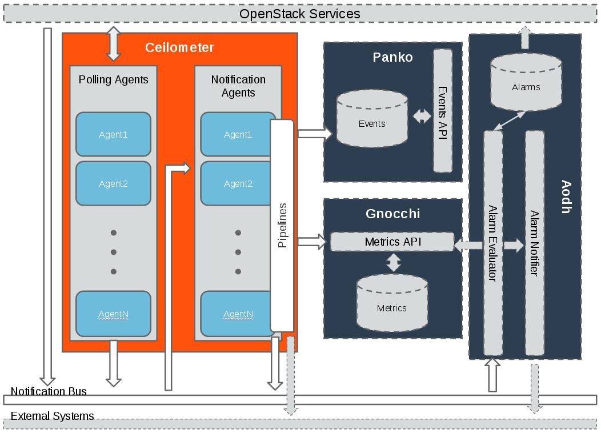
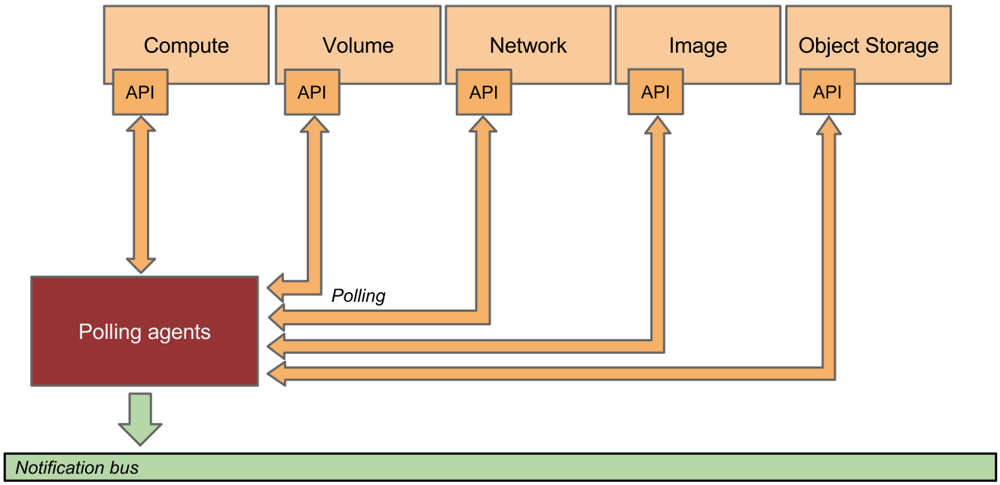
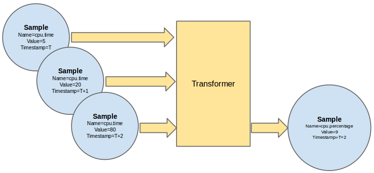
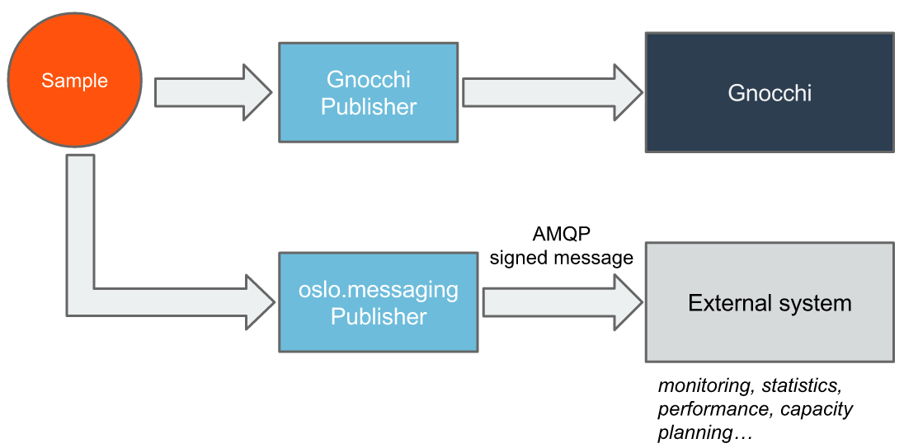

# 1. Vai trò của project Telemetry

Ceilometer project được bắt đầu từ năm 2012 với mong muốn cung cấp 1 infrastructure để thu thập toàn bộ các dữ liệu của các OPS projects khác. Những dữ liệu này có thể được sử dụng để tính toán chi phí cũng như được đẩy tới các công cụ giám sát khác phục vụ mục đích giám sát hệ thống.

Đối với việc tính toán chi phí, Ceilometer được sinh ra chỉ để phục vụ mục đích thu thập, còn việc đánh giá cũng như tính toán chi phí cụ thể và chi tiết thì khách hàng sẽ phải sử dụng thêm các sản phẩm khác.

Trước đây khi mới xuất hiện, Ceilometer đảm đương mọi công việc từ thu thập metrics, events, lưu và cảnh báo. Sau này khi nhận thấy những hạn chế của nó, Ceilometer đã được chia nhỏ ra thành 4 projects nhỏ đó là: Aodh, Ceilometer, Gnocchi và Panko.

+ Aodh: là project được dùng để đưa ra những cảnh báo dựa trên các rule sử dụng các metrics và events mà Ceilometer thu thập được

+ Ceilometer: thu thập, quy hoạch và chuyển đổi dữ liệu được cung cấp từ các service trong OPS. Dữ liệu này được sử dụng cho Aodh và Gnocchi.

+ Panko: Được thiết kế để lưu thông tin của events (những sự kiện như boot máy ảo, migrate,...), điều này giúp người dùng có thể lưu được trạng thái của OPS resource trong một thời gian nhất định.

+ Gnocchi: Cung cấp time-series db để lưu các thông tin của metrics.

# 2. Kiến trúc hệ thống

+ Meter : Các item đã được đo lường

+ Sample: Giá trị chính của meter trên resource chính (nhiều meter có thể dùng để tính toán ra 1 sample)

+ Events: Các sự kiện trong hệ thống như tắt máy ảo,...



Hình trên miêu tả tổng quan kiến trúc logic của Ceilometer

Mỗi một service được thiết kế có khả năng mở rộng theo chiều ngang. Ceilometer có 2 service chính đó là:

+ polling agent : Dùng để poll OPS services và xây dựng công cụ đo lường.

+ notification agent: Lắng nghe các thông báo trên message queue, convert nó sang events và samples sau đó thực hiện các pipeline actions.


**Thu thập dữ liệu**


Hình dưới đây miêu tả vì sao Ceilometer lại thu tập được ở rất nhiều nguồn khác nhau.

Có 2 phương thức để thu thập dữ liệu đó là:

+ notification agent: lấy những message được tạo ra trên notification bus và chuyển đổi nó sang samples hoặc events

+ polling agent: poll vài api hoặc các tool khác để thu thập dữ liệu theo một khoảng thời gian nhất định


Phương thức thứ nhất được hỗ trợ bởi ceilometer-notification agent. Polling agent có thể được cấu hình để poll local hypervisor hoặc remote APIs.


Notification agent thu thập messages từ các services. notification daemon sẽ giám sát các message queue được gửi bởi các thành phần của OPS như Nova, Glance, Cinder, Neutron, Swift, Keystone, and Heat.


Notification daemon sẽ load 1 hoặc vài plugins sử dụng namespaces ceilometer.notification. Mỗi một plugin mặc định sẽ lắng nghe từ notifications.info, notifications.sample, and notifications.error.





Việc polling compute resource được phụ trách bởi polling agent trên compute node. Polling thông qua api đối với các resource khác được thực hiện bởi agent chạy trên controller (central-agent). Polling agent được config để chạy 1 hoặc nhiều pollster plugin sử dụng kết hợ giữa các namespaces ceilometer.poll.compute, ceilometer.poll.central, and ceilometer.poll.ipmi.


**Xử lí data**


**Pipeline Manager**


Pipeline là một danh sách các quá trình xử lí thay đổi data point vào một số publisher để đẩy ra các external systems.

Ceilometer cấu hình transformer và publisher cho meter ở file `/etc/ceilometer/pipeline.yaml`


**Transforming the data**





Trên đây là ví dụ về việc thu thập nhiều samples cpu useage và tổng hợp lại thành single cpu percentage smaple.


<pre>
sources: A source is a producer of samples
......
  - name: cpu_source
    interval: 600
    meters:
        - " cpu "
    sinks:
        - cpu_sink

......
sinks: A sink on the other hand is a chain of handlers of samples
......
  - name: cpu_sink
    transformers:
      - name: "rate_of_change"
        parameters:
                target:
                    name: "cpu_util"
                    unit: "%"
                    type: "gauge"
                    scale: "100.0 / (10**9 * (resource_metadata.cpu_number or1))"
     publishers:
         - notify: //
</pre>


+ interval: Poll sau 10 phút

+ cpu meter ở đây sử dụng transformer rate_of_change

+ publisher ở đây là notify://, nó sẽ gửi data ra AMQP, bắt đầu từ khi có gnocchi, mặc định publisher sẽ là gnocchi://

+ transformer là sample converter, nó bao gồm:		

 
<ul>

+ Unit_conversion: unit converter, ví dụ chuyển từ °F sang °C

+ Rate_of_change: Calculation mode converter, ví dụ convert sample dựa theo các rule cố định

</ul>
``` sh
transformers:
          - name: "rate_of_change"
            parameters:
                target:
                    name: "cpu_util"
                    unit: "%"
                    type: "gauge"
                    max: 100
                    scale: "100.0 / (10**9 * (resource_metadata.cpu_number or 1))"
```

**Publishing the data**





Hình trên miêu tả cách sample được publish tới các điểm đích

Hiện tại có 7 cách:

+ Gnocchi, nó sẽ đẩy sample và events lên Gnocchi APIs

+ notifier, push sample sang message queue có thể dùng cho external system.

+ udp, publish sử dụng udp packets

+ http, target là REST interface

+ file, publish sample ra file


Có thể add nhiều publisher cho 1 meter. Ví dụ như


``` sh
publishers:
    - gnocchi://
    - panko://
    - udp://10.0.0.2:1234
    - notifier://?policy=drop&max_queue_length=512&topic=custom_target
```

**Storing/Accessing the data**


Trước đây data thường được lưu vào db (mặc định là MongoDB), hoặc nó cũng có thể được lưu vào file hoặc http target. Sau này khi đã có gnocchi, OPS khuyến cáo sử dụng Gnocchi để làm time-series storage và resource lifecycle tracking.


	


